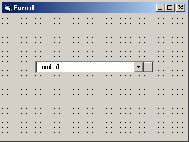



## A Combo Box with A Command Button

### Description

I created this control because i was sick of putting a command button in a couple picture boxes to get the effect of the button being part of the combo box control. The button click event and most of the combo box properties and events can called from the single new control. It's pretty slick. I use the control to list differnt names and categories. When i need to add a name or category i use the click event from the command button to launch a new form which i can enter the new data. At the end of the click event i refresh the data in the combo box.

Hope someone else can get some use out of it. I know it's simple... i looked for something like it, but found nothing... granted i didnt search too long since i knew i could create it in only a few minutes. I should have done it a while ago... LOL.

Oh well... vote for me please.

Thanks!
 
### More Info
 

             |
---                |---
**Submitted On**   |2006-08-26 16:57:20
**By**             |[\( \. Y \. \)](https://github.com/Planet-Source-Code/PSCIndex/blob/master/ByAuthor/y.md)
**Level**          |Intermediate
**User Rating**    |4.3 (13 globes from 3 users)
**Compatibility**  |VB 6\.0
**Category**       |[Custom Controls/ Forms/  Menus](https://github.com/Planet-Source-Code/PSCIndex/blob/master/ByCategory/custom-controls-forms-menus__1-4.md)
**World**          |[Visual Basic](https://github.com/Planet-Source-Code/PSCIndex/blob/master/ByWorld/visual-basic.md)
**Archive File**   |[A\_Combo\_Bo2016078262006\.zip](https://github.com/Planet-Source-Code/y-a-combo-box-with-a-command-button__1-66302/archive/master.zip)

